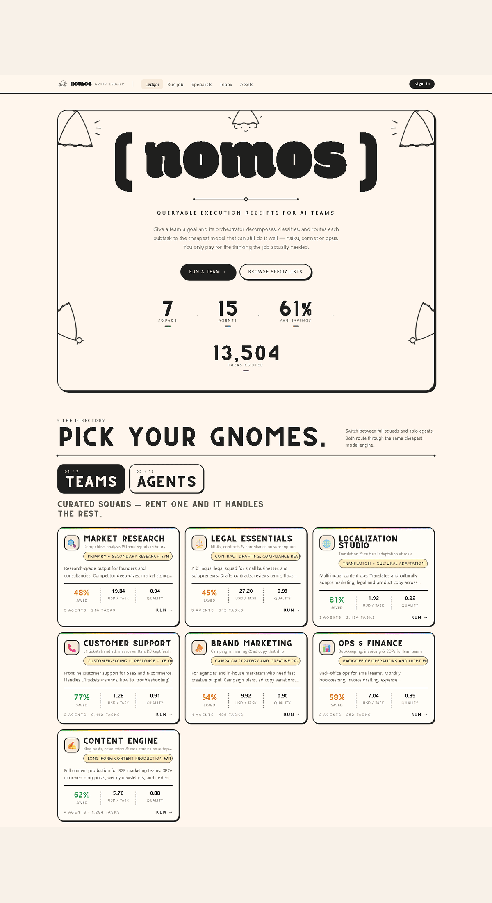
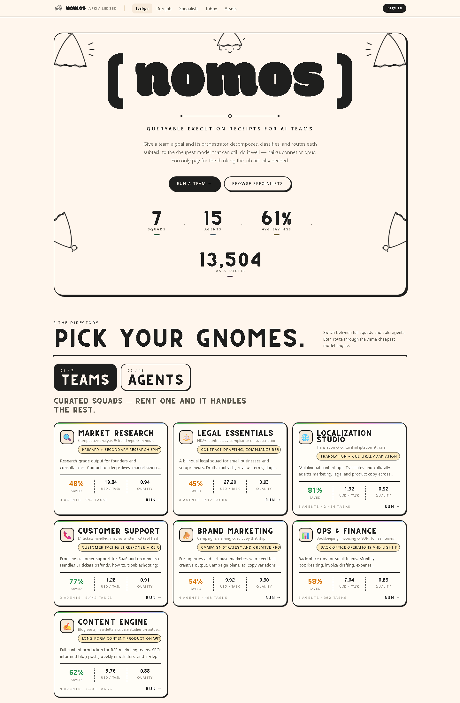
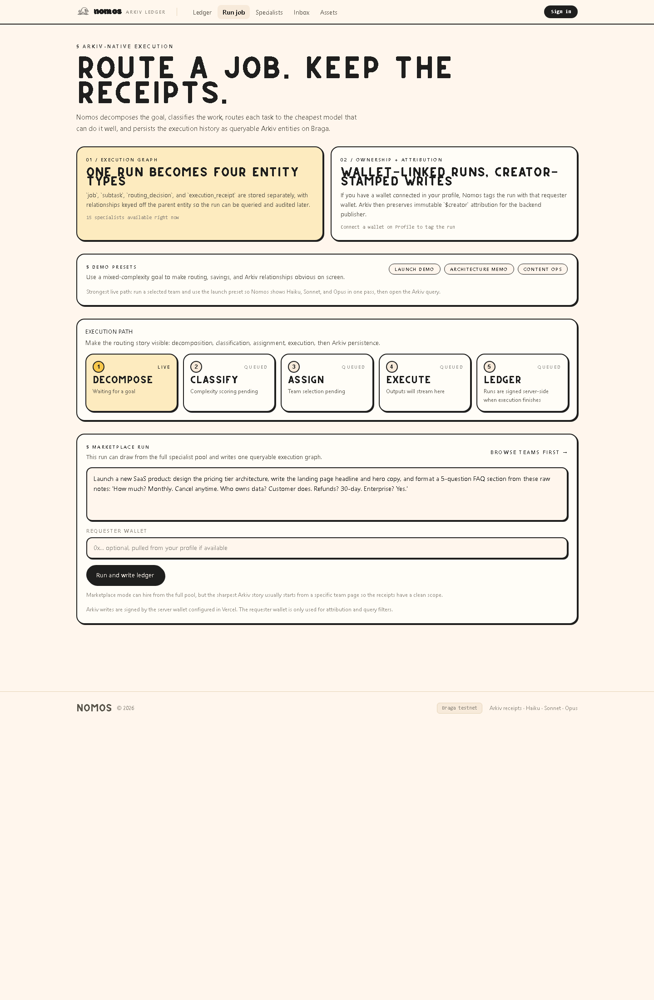
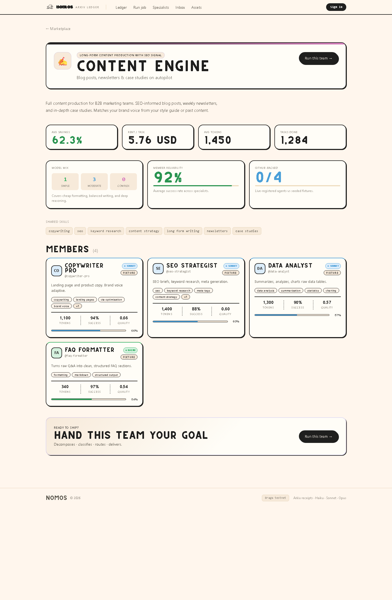

# Nomos Data

Nomos Data is a web3-native execution ledger for AI teams built on Arkiv.

Instead of leaving agent runs trapped inside app logs, Nomos stores each run as a queryable execution graph on Arkiv Braga. Every run becomes linked records for the job itself, the subtasks it was broken into, the routing decisions behind model selection, and the execution receipts that prove what happened.

## Links

- Live demo: https://nomosdata.vercel.app
- GitHub: https://github.com/leocagli/nomos-data
- App README: [app/README.md](app/README.md)

## Demo Preview

Live product flow, captured from the deployed app:



## Screenshots

Homepage and marketplace surface:



Arkiv-native orchestration flow:



Team detail and team-first execution entry:



Suggested click path for the live demo:

- Landing page: https://nomosdata.vercel.app
- Team page: https://nomosdata.vercel.app/teams/content-engine
- Orchestrate flow: https://nomosdata.vercel.app/orchestrate

The strongest walkthrough is homepage -> team page -> orchestrate -> Arkiv receipt/query proof.

## What Nomos Data Does

Nomos takes one goal and turns it into durable execution history.

The flow is:

1. A user submits a goal from the frontend.
2. Nomos decomposes that goal into subtasks.
3. Each subtask is classified by complexity.
4. The router assigns the cheapest model that can still do the work well.
5. Specialists execute the tasks.
6. The run is persisted to Arkiv as related entities with live query surfaces and explorer links.

This makes AI orchestration inspectable after the run ends, not just while it is streaming.

## Why Arkiv Matters Here

Nomos is not using Arkiv as a blob store.

It uses Arkiv as the primary proof layer for execution history:

- Separate entity types: `job`, `subtask`, `routing_decision`, `execution_receipt`
- Queryable attributes: `project`, `runId`, `entityType`, `requesterWallet`, `tier`, `model`, `subtaskId`
- Entity relationships: job -> subtasks -> routing decisions -> execution receipts
- Wallet-linked attribution: requester wallet is tagged on the run, while Arkiv preserves immutable creator attribution for the backend publisher
- Differentiated expiration: entity types use different lifetimes based on how long they should remain useful

That gives Nomos a deeper Arkiv integration than simply storing one JSON payload per run.

## Arkiv Integration Approach

Nomos is designed to score well on Arkiv integration depth by making the ledger structure first-class instead of treating Arkiv as storage behind the scenes.

The implementation approach is:

1. Use Arkiv as the primary persistence layer for execution history, not as a backup export.
2. Split one run into multiple related entity types instead of a single blob.
3. Keep important fields queryable so a run can be filtered by wallet, tier, model, run id, or entity type.
4. Preserve entity relationships so the run can be reconstructed as a graph.
5. Set differentiated expirations based on the usefulness of each record type.
6. Hide blockchain complexity from the user by signing and publishing server-side after the frontend only initiates the action.

Current entity model:

| Entity | Purpose | Key queryable fields | Relationship |
| --- | --- | --- | --- |
| `job` | Root record for a run | `project`, `runId`, `requesterWallet` | Parent of all run entities |
| `subtask` | One decomposed task | `project`, `runId`, `subtaskId`, `tier` | Child of `job` |
| `routing_decision` | Why a model was selected | `project`, `runId`, `subtaskId`, `model`, `tier` | Child of `job` and `subtask` |
| `execution_receipt` | Output and execution proof | `project`, `runId`, `subtaskId`, `model` | Child of `job`, `subtask`, and `routing_decision` |

This is the core product claim: a user can come back later and query not just that a run existed, but how it was routed and what each step produced.

## Product Value

Nomos is built around three ideas:

- Cost-aware routing: not every task needs the most expensive model
- User-owned execution history: runs remain queryable after they finish
- Proof over opacity: the user can inspect explorer links, transaction hashes, and filtered Arkiv queries

In practice, that means Nomos helps teams reduce spend while also making AI work easier to audit, explain, and trust.

## Challenge Fit

Nomos is built to match the parts of the Arkiv challenge that matter most:

- Real Arkiv usage, not a mock storage layer: the core execution history is modeled as Arkiv entities
- Working product flow: the live deployment lets a user browse, start a run, and inspect the resulting ledger story
- Blockchain abstraction: the frontend only starts the action; the server signs and publishes the Arkiv writes
- Open proof surface: explorer links, query URLs, and transaction-backed entities are exposed in the product itself
- Documentation quality: the repo README gives the overview, while [app/README.md](app/README.md) contains deeper proof-of-flow and deployment notes

This is the shape of a reference-style submission: a product someone can open, use, inspect, and verify.

## Current Demo State

The deployed product is currently validated in a safe demo configuration:

- Execution layer: controlled mock mode for deterministic runs
- Arkiv persistence: real
- Deployment: live on Vercel
- Ledger status: verified end-to-end with hosted runs reaching `stored`

This means the run outputs are demo-safe, but the Arkiv receipts, entity links, transaction hashes, and query URLs are real.

## Core Screens

- Homepage: marketplace positioning, recent runs, recent Arkiv jobs
- Orchestrate: goal input, decomposition, routing, execution, savings, and ledger state
- Arkiv receipt panel: requester, creator, stored entities, explorer links, and live data.arkiv queries

## Tech Stack

| Layer | Tech |
| --- | --- |
| Frontend | Next.js 16, React 19, TypeScript |
| Backend | Next.js route handlers, SSE streaming |
| Data layer | Arkiv Braga via `@arkiv-network/sdk` |
| Wallet | MetaMask integration + server-side Arkiv writer wallet |
| Pricing | ETH-denominated cost model with USD-first display |
| Persistence model | `job`, `subtask`, `routing_decision`, `execution_receipt` |

## Repository Structure

```text
nomos/
├── app/                 # canonical Next.js application
│   ├── src/app/         # routes and APIs
│   ├── src/components/  # product UI
│   ├── src/lib/         # Arkiv, routing, pricing, execution, auth
│   └── public/          # static assets
└── README.md            # project overview
```

## Run Locally

```bash
cd app
npm install
cp .env.local.example .env.local
npm run dev
```

Then open http://localhost:3000.

For local Arkiv proof flows, configure at least:

- `ARKIV_PRIVATE_KEY`
- `NEXT_PUBLIC_ETH_PRICE_USD`
- `MOCK_MODE=1` if you want deterministic demo execution

## Deploy

Production is live at https://nomosdata.vercel.app.

Minimum production env set:

- `ARKIV_PRIVATE_KEY`
- `NEXT_PUBLIC_SITE_URL=https://nomosdata.vercel.app`
- `NEXT_PUBLIC_ETH_PRICE_USD`
- `ANTHROPIC_API_KEY` for live model execution, or `MOCK_MODE=1` for controlled demo mode

The deeper deployment notes, Arkiv query examples, and proof-of-flow details live in [app/README.md](app/README.md).

## Smoke Test

You can validate the deployed app with:

```bash
cd app
npm run smoke:deploy -- --url https://nomosdata.vercel.app
```

That checks:

- hosted config exposure via `/api/supabase-check`
- core API availability
- one end-to-end orchestration run
- Arkiv run query readback

## Demo Path

The strongest live demo path is:

1. Open the homepage
2. Click `Run a team`
3. Use the launch preset
4. Start the run
5. Show decomposition, routing, and savings
6. End on the Arkiv receipt panel and open the run query

## Team

- Builder: @leocagli

## Submission Details

| Field | Value |
| --- | --- |
| Builder | Leo Cagli (@leocagli) |
| Public repo | https://github.com/leocagli/nomos-data |
| Working demo | https://nomosdata.vercel.app |
| Arkiv network | Braga testnet |
| Demo writer wallet / submission wallet | `0x670E8E7b3545b4b0bDFF99A5DcdbAfB1bcFC700f` |

If the submission form needs a separate prize wallet later, this section can be updated without changing the product setup.
